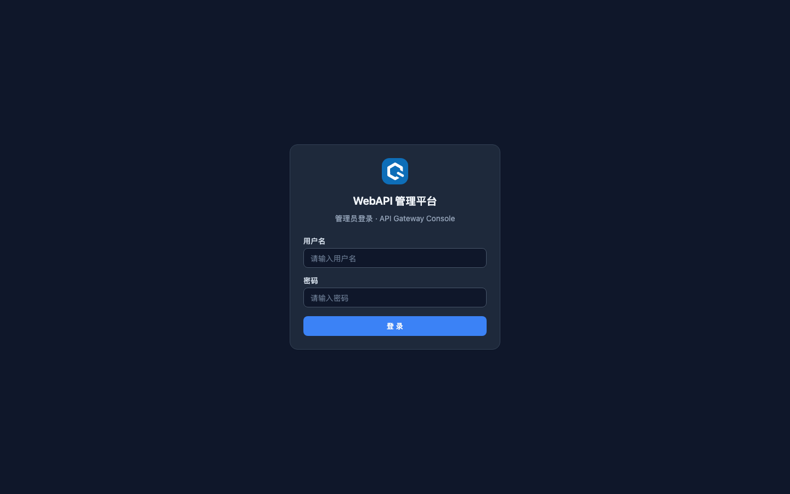
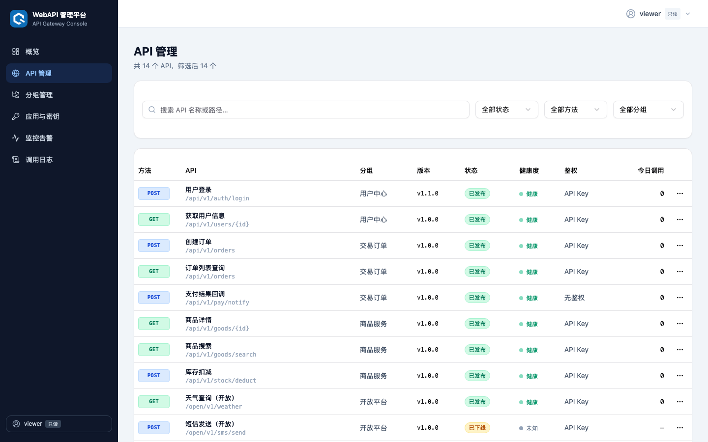
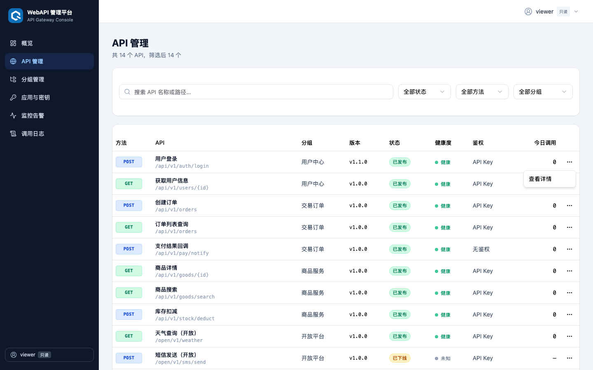
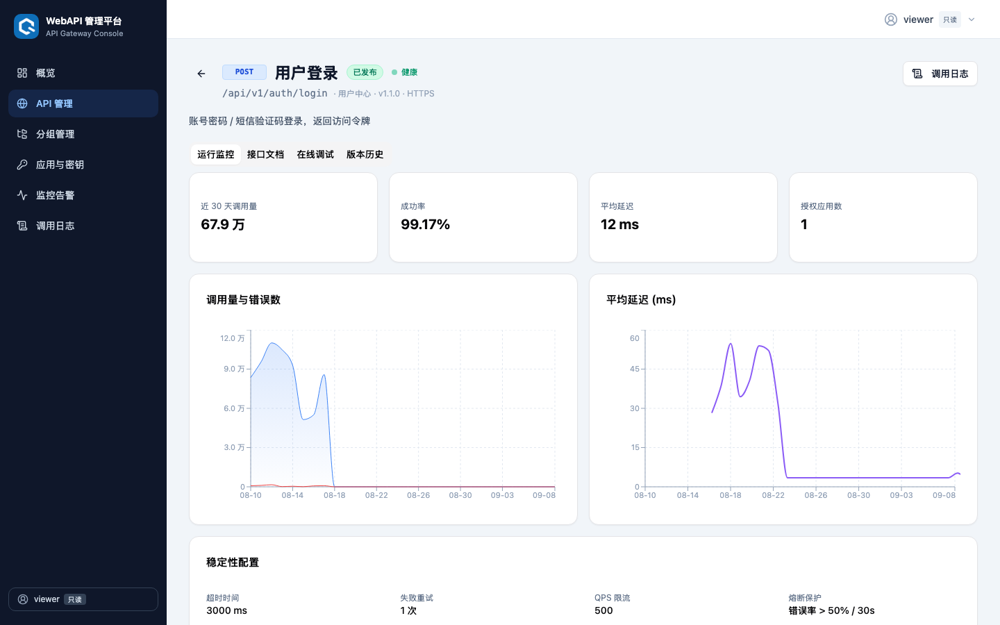
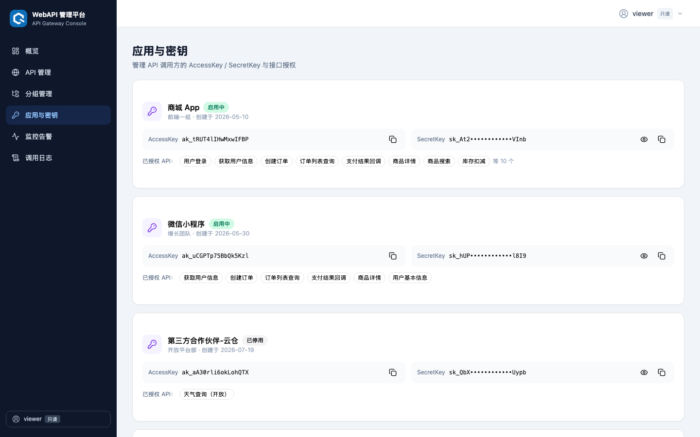
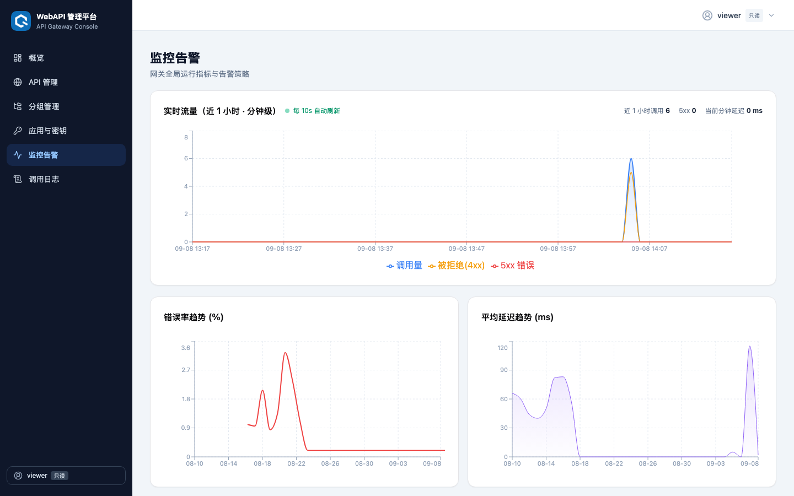
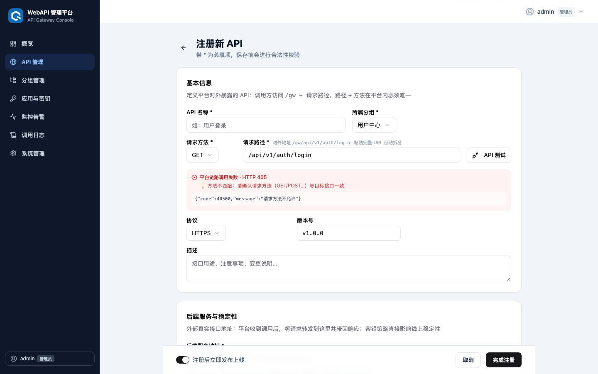
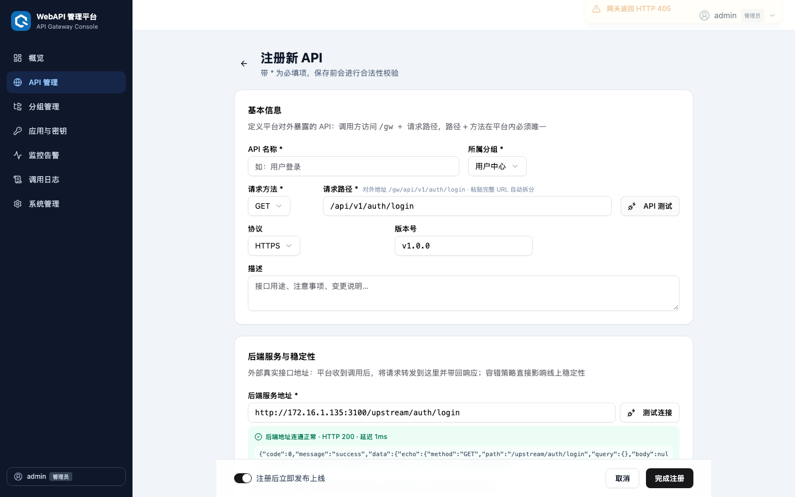
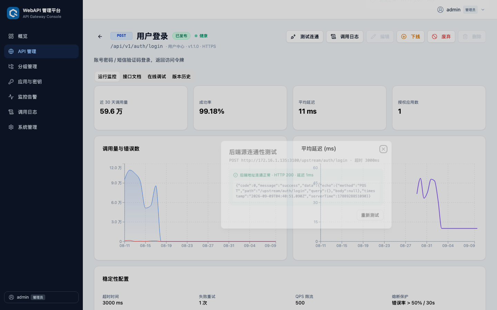

# WebAPI 管理平台

对标市面主流 API 管理平台（如 Apifox / YApi / Konga）的全栈 API 网关管理控制台：**真实网关转发 + 管理控制台**，覆盖 API 从注册、发布、监控到废弃的完整生命周期。

## 功能总览

| 模块 | 能力 |
|---|---|
| **平台概览** | API 总数、今日调用量、成功率、告警统计；30 天调用趋势、状态分布饼图、Top 5 调用量排行、健康度一览 |
| **API 注册** | 分段式表单：基本信息（路径 + 方法全局唯一性校验）、后端服务地址、超时 / 失败重试 / QPS 限流 / **熔断保护**等稳定性配置、鉴权方式（无鉴权 / API Key / OAuth2 / JWT）、Query / Header / Body 参数文档（string / number / boolean / array / **object** 五种类型，对象参数建议配合点号路径逐行描述嵌套字段）、响应示例（JSON 合法性校验）；**注册前双路连通性测试：「API 测试」验证平台网关链路、「测试连接」直连后端地址，统一结果展示并附状态码排查提示** |
| **API 管理** | 关键词搜索 + 状态 / 方法 / 分组多维筛选；草稿 → 已发布 → 已下线 → 已废弃 完整生命周期流转；下线 / 废弃 / 删除均需弹窗二次确认，**已授权给启用中应用的 API 禁止下线/废弃（前后端双重拦截，需先停用应用或解除授权）**，**已发布状态的 API 禁止编辑（需先下线，前后端双重校验）**，仅废弃状态可删除（前后端双重校验），删除联动清理应用授权 |
| **API 详情** | 运行监控图表（调用量 / 错误数 / 延迟趋势，来自网关真实流量）、接口文档（含一键复制 cURL）、**在线调试**（通过网关发起真实请求，计入指标；**按参数声明类型发送真实 JSON 值：object/array 用多行 JSON 输入框并解析校验，number 转数值，boolean 转布尔，非法输入直接拦截不发请求**）、**「测试连通」弹窗随时复测后端源（展示目标地址 / 方法 / 超时与结果详情）**、版本历史时间线 |
| **分组管理** | 分组 CRUD，非空分组禁止删除（保护性约束） |
| **应用与密钥** | 调用方应用管理；AccessKey / SecretKey 自动生成、脱敏显示、一键复制（局域网 HTTP 访问自动降级复制方案）；**SecretKey 重置管控：启用中应用禁止重置，需先停用并弹窗二次确认**；按 API 粒度勾选授权，授权标识同步展示 API 最新状态（草稿 / 已下线 / 已废弃）；应用启停控制（停用后网关立即拒绝调用） |
| **监控告警** | **实时流量图（近 1 小时分钟级，10s 自动刷新，含 5xx / 4xx 拒绝 / 平均延迟曲线）** + 30 天错误率 / 延迟趋势；告警规则 CRUD（错误率 / 延迟 / QPS 阈值，三级级别）；超阈值自动生成告警记录，支持标记处理与「未处理 / 全部告警」视图切换 |
| **调用日志** | 网关全量请求审计（含 401/403/404/429 等被拒绝请求）：时间、API、路径、调用方应用、状态码、耗时、拒绝原因；按 API / 状态码分类 / 调用方 / 关键词筛选，服务端分页，支持 5 秒自动刷新 |
| **多用户角色** | 三级角色体系：**管理员**（全部权限，含用户管理 / 删除 / 归档）、**操作员**（注册、发布、编辑、确认告警）、**只读**（仅查看）；服务端接口级权限校验（viewer 写操作一律 403），前端同步按角色隐藏/禁用写操作入口（注册、编辑、上下线、废弃、删除、启停、密钥重置、告警处理、规则维护等），删除类操作仅管理员可见；角色变更 / 删除后旧会话立即失效，系统保证至少保留一名管理员 |
| **日志自动归档** | 调用日志与操作审计日志默认保留 30 天（`LOG_RETENTION_DAYS` 可调），超期记录启动时 + 每 24 小时自动压缩为 gzip NDJSON 归档文件（`server/archives/`，按类型区分 `logs-archive-*` / `audit-archive-*`）后从库中清除；支持手动触发、类型徽章、列表查看与下载 |
| **操作审计** | 全量记录管理操作：登录成功/失败、退出、改密、用户增删改、API/分组/应用/规则的保存与删除、状态流转、告警确认、归档、备份恢复、数据重置；含操作人、角色、对象、详情、IP，支持按用户 / 关键词筛选与分页（仅管理员可见） |
| **备份与恢复** | 一键下载完整数据库备份（VACUUM INTO 一致性快照）；上传备份文件整体恢复业务数据，可选同时恢复用户账号（恢复后全部会话强制失效）；文件合法性与表结构校验，仅管理员可操作 |

## 技术栈

**前端**：React 19 + TypeScript + Vite · Tailwind CSS + shadcn/ui · Recharts · React Router 7

**后端**：Node.js 原生 `node:http` + `node:sqlite`（零第三方依赖，Node 20.17+ / 22.5+ 需 flag，推荐 Node 24），SQLite 文件持久化（`server/data.db`）

- 管理 API（`/admin/*`）：API / 分组 / 应用 / 告警规则的增删改查、状态流转、指标聚合查询
- **控制台登录认证**：账号密码登录（**scrypt 加盐哈希**存储，旧 SHA-256 数据登录后自动升级）、Bearer 会话令牌（12 小时过期）、连续 5 次失败锁定 5 分钟、**初始密码首次登录强制修改**、修改密码后全会话失效；`/admin/*` 除登录外均需鉴权，数据面 `/gw/*` 不受影响仍用应用密钥
- **安全加固**：全站安全响应头（CSP / X-Frame-Options / nosniff / Referrer-Policy）；管理接口 CORS 默认不下发（跨域需配置 `CORS_ORIGIN` 白名单）；请求体大小上限（网关默认 10MB，`GATEWAY_MAX_BODY` 可调）；连通性测试内置 SSRF 防护（云元数据 / 回环 / 链路本地地址拦截，`ALLOW_LOCAL_TEST=1` 可放行本机联调）
- **用户与角色（`/admin/users`）**：多用户 CRUD（仅管理员），viewer / operator / admin 三级接口级权限控制，角色或密码变更后该用户会话立即失效，禁止删除自己或唯一管理员；**只读角色看到的 SecretKey 为脱敏掩码**
- **日志归档（`/admin/archives`）**：`LOG_RETENTION_DAYS`（默认 30）天前的调用日志与操作审计日志分别自动导出为 `logs-archive-*.ndjson.gz` / `audit-archive-*.ndjson.gz` 并从库中删除；仅管理员可手动触发 / 列表 / 下载
- **操作审计（`/admin/audit-logs`）**：登录、增删改、状态流转、归档等管理操作全量落库（操作人/角色/对象/详情/IP），仅管理员可查询，容量上限 5 万条自动修剪
- **备份恢复（`/admin/backup`）**：`VACUUM INTO` 生成一致性快照供下载；上传备份文件事务内整体替换业务表（可选含用户表，恢复后注销全部会话），非法文件与缺表备份会被拒绝
- 真实网关（`/gw/*`）：注册路径（含 `{param}` 占位符）匹配转发、**AccessKey + SecretKey 双因子鉴权**（密钥由服务端加密安全随机数生成，常量时间比较）与应用授权校验、QPS 限流、超时 / 失败重试、**熔断保护**（窗口内错误率超阈值自动开启）、调用指标落库、超阈值自动生成告警
- 内置 mock 上游（`/upstream/*`）：echo 服务，支持 `?__fail=500` 与 `?__delay=ms` 故障注入，便于验证告警与熔断链路

## 本地启动

```bash
npm install
npm run dev        # 一键同时启动后端(3100)与前端(3000)，支持 -- --port <N> 透传给 Vite
```

初始管理员账号：**admin / Admin@123**（首次登录将**强制修改初始密码**，请妥善保管新密码）。

也可分开启动：`npm run server`（仅后端）、`npm run dev:web`（仅前端）。

打开前端后，在「应用与密钥」复制任一启用中应用的 AccessKey 与 SecretKey，即可通过网关真实调用：

```bash
curl -H "X-Access-Key: <AccessKey>" -H "X-Secret-Key: <SecretKey>" http://localhost:3100/gw/api/v1/users/123
```

## 构建与部署（局域网 / 服务器）

```bash
npm run build      # 构建前端产物到 dist/
npm run server     # 启动一体化服务（默认绑定 0.0.0.0:3100）
```

后端启动后会**直接托管前端静态资源**，无需 Nginx：同一局域网内的任意计算机访问 `http://<服务器IP>:3100` 即可使用完整系统（控制台 + 管理 API + 网关）。自定义监听地址：`HOST=0.0.0.0 PORT=8080 node server/index.js`。如需公网访问，请自行在前面加一层 Nginx/HTTPS。

| 环境变量 | 默认值 | 说明 |
|---|---|---|
| `PORT` | `3100` | 后端监听端口 |
| `HOST` | `0.0.0.0` | 监听网卡（默认允许局域网访问） |
| `LOG_RETENTION_DAYS` | `30` | 调用日志保留天数，超期自动归档压缩 |
| `CORS_ORIGIN` | 空 | 管理接口跨域白名单（逗号分隔，如 `https://a.com,https://b.com`）；默认不下发 CORS 头，同源部署无需配置 |
| `GATEWAY_MAX_BODY` | `10485760` | 网关单请求体上限（字节），超限返回 413 |
| `ALLOW_LOCAL_TEST` | 关 | 置 `1` 时连通性测试允许访问本机回环地址（仅本机联调使用；云元数据地址始终拦截） |
| `TRUST_PROXY` | 关 | 部署在 Nginx/Caddy 等反向代理之后时置 `1`，审计与登录日志将记录 `X-Forwarded-For` 首跳的真实客户端 IP（直连部署请勿开启，否则访客可伪造 IP） |

> 公网部署安全基线：务必在前面加 Nginx/Caddy 终结 HTTPS（反代后同步开启 `TRUST_PROXY=1` 以记录真实客户端 IP）；修改默认管理员密码（首次登录已强制，且初始密码账号在服务端被阻断一切管理操作）；按需配置 `CORS_ORIGIN`；不要开启 `ALLOW_LOCAL_TEST`。

> 防火墙提示：若其他计算机无法访问，请确认服务器防火墙放行了对应端口（如 macOS 系统设置 → 网络 → 防火墙）。

**Windows / IIS 部署**：本系统不是纯静态站点，仅把 `dist/` 挂到 IIS 会在登录/加载数据时报 405。正确做法：

1. 在服务器安装 Node.js 24+，运行 `npm run server`（后端监听 3100 并可直接对外提供全部功能，此时可不使用 IIS）；
2. 若必须经 IIS（如占用 80 端口）：安装 **URL Rewrite** 与 **Application Request Routing (ARR)** 扩展，在 ARR 中勾选 *Enable proxy*，并确保 `dist/` 中的 `web.config`（已随构建自动输出）保留在站点根目录——它会将 `/admin/*` 与 `/gw/*` 反向代理到本机 Node 后端。

## 测试与质量保障

仓库配置了 GitHub Actions CI（`.github/workflows/ci.yml`），每次推送自动执行三个作业：

| 作业 | 内容 |
|---|---|
| 前端构建 | `tsc` 类型检查 + `vite build` |
| 后端冒烟 | 启动 + 健康检查 + 登录鉴权 + `scripts/e2e.mjs` 全链路回归 |
| 前端 UI 冒烟 | Playwright（无头 Chromium）：登录页渲染 → 错误密码提示 → 登录后控制台渲染 |

本地回归（需先启动一个**测试实例**，e2e 会在其中创建 `smoke-*` 测试数据，请勿对生产实例运行）：

```bash
npm run test:e2e   # 后端链路 23 项断言：注册→连通性测试（含 SSRF 拦截）→发布→授权→双因子网关调用→密钥重置管控→安全管控(401/403/405/停用)→日志与审计落库
npm run test:ui    # Playwright UI 冒烟（首次运行需 npx playwright install chromium）
```

两个命令均支持指向其他实例：`BASE=http://<host>:<port> npm run test:e2e`、`BASE_URL=http://<host>:<port> npm run test:ui`。

## 界面截图（只读角色视角）

以下截图使用只读（viewer）账号实际登录截取，展示前端按角色收敛后的界面效果：全部写操作入口（注册、编辑、上下线、删除、启停、密钥重置、告警处理等）均已隐藏，仅保留查看能力。

| 登录页（无默认账号提示） | API 管理（无注册按钮） |
|---|---|
|  |  |

| 行内菜单（仅查看详情） | API 详情（仅调用日志入口） |
|---|---|
|  |  |

| 应用与密钥（只读） | 监控告警（只读） |
|---|---|
|  |  |

## 界面截图（连通性测试）

系统提供三处统一的连通性测试入口，失败时自动给出状态码排查提示：

| 注册页「API 测试」（平台网关链路） | 注册页「测试连接」（后端地址直连） |
|---|---|
|  |  |

| API 详情页「测试连通」弹窗（后端源复测） |
|---|
|  |

## 运行健康监控（可选，平台之外）

系统自带 `/healthz` 健康检查端点（无需鉴权，返回 `{"ok": true, "uptime": <秒>}`），可接入任意外部监控。本项目作者的部署配套了三条轻量自动化任务（纯本地 HTTP 探测，不占模型额度），供参考复用：

| 任务 | 触发方式 | 作用 |
|---|---|---|
| 健康检查 | 每 5 分钟定时 | 更新运行状态卡片（在线/离线、持续运行时长、探测延迟、近 30 次探测趋势） |
| 离线告警 | 每 10 分钟条件探测 | 仅在「在线 → 离线」翻转时推送一次本地错误通知（边缘触发，不重复打扰） |
| 恢复通知 | 每 10 分钟条件探测 | 仅在「离线 → 在线」翻转时推送一次本地成功通知 |

自行搭建等价监控的最小方案（crontab 示例，离线时写入系统日志）：

```bash
*/5 * * * * curl -sf --max-time 5 http://localhost:3100/healthz > /dev/null || logger -t webapi-platform "health check failed"
```

## 目录结构

```
src/
├── components/        # Layout 布局、通用徽标组件、shadcn/ui 组件库
├── lib/
│   ├── store.tsx      # 全局状态：动作先同步后端，成功后更新本地
│   ├── api.ts         # 后端 API 客户端 + useMetrics 指标 Hook
│   └── metrics.ts     # 格式化工具
├── pages/             # Dashboard / ApiList / ApiForm / ApiDetail / Groups / Apps / Monitor / Logs / Settings
└── types/             # TypeScript 类型定义

server/
├── index.js           # HTTP 服务：管理 API + 网关转发 + mock 上游 + 静态托管
├── auth.js            # 登录认证、会话、多用户与角色（viewer/operator/admin）
├── archive.js         # 调用日志自动归档（gzip NDJSON 导出 + 定期清理）
├── db.js              # SQLite 表结构、读写、指标聚合
└── seed.js            # 内置示例数据（11 个 API / 4 分组 / 3 应用 / 告警规则 / 30 天历史指标）

scripts/
└── e2e.mjs            # 后端链路冒烟（16 项断言，CI 自动执行）

e2e-ui/                # Playwright 前端 UI 冒烟用例
playwright.config.js   # Playwright 配置（BASE_URL 指向目标实例）
```

## 说明

- 首次启动后端时自动灌入示例数据（含 30 天历史指标）；如需恢复出厂状态，登录后调用 `POST /admin/reset` 即可
- 示例 API 的后端地址指向内置 mock 上游，开箱即可真实调通；注册自己的 API 时把后端地址改成任意可访问的 http(s) 地址即可
- 健康度基于最近 5 分钟真实调用的错误率计算；限流与熔断为内存态，重启后端后清零
